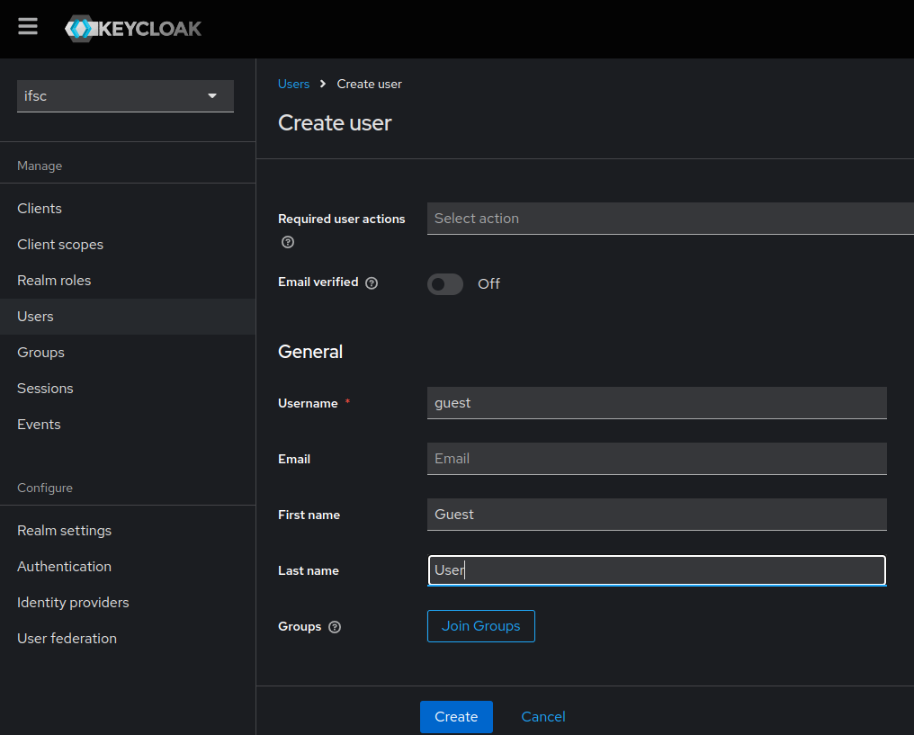
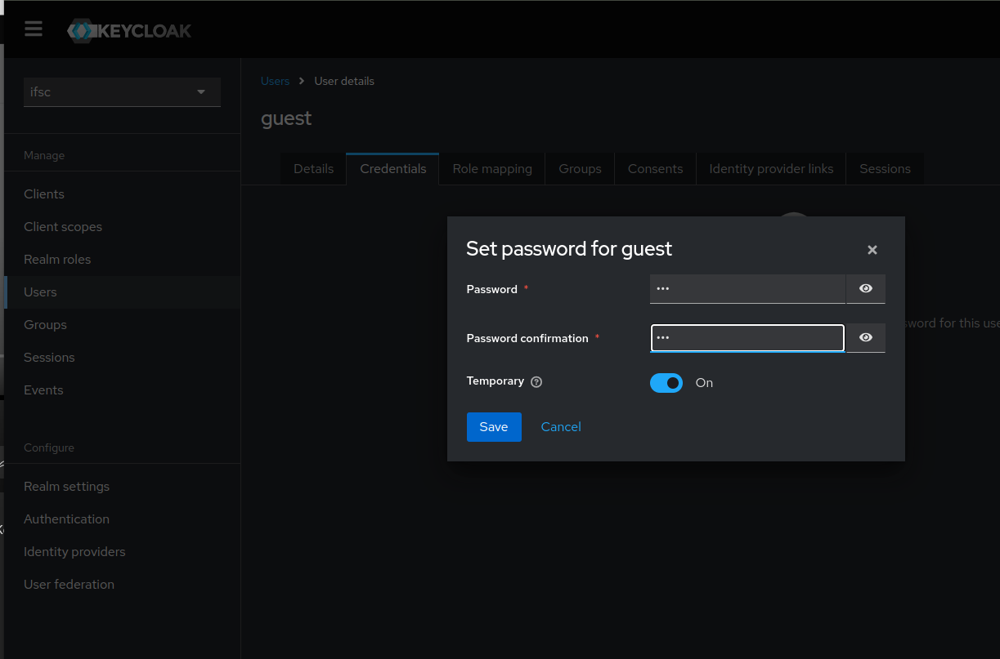
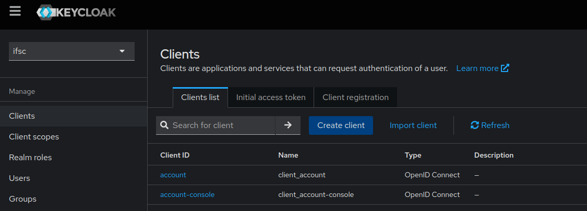
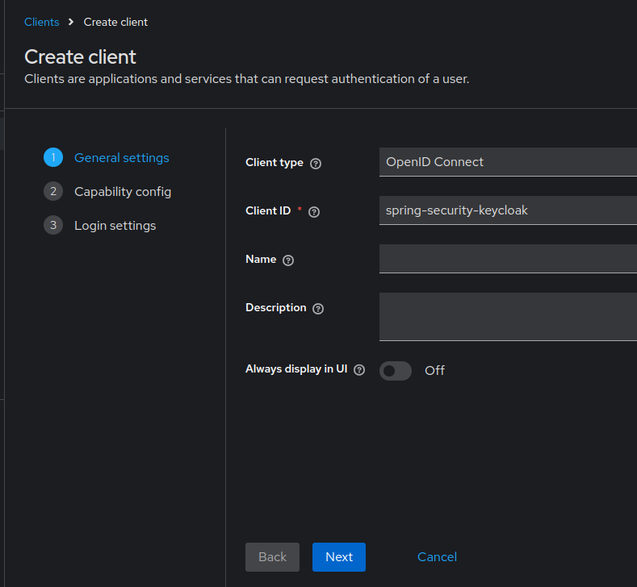
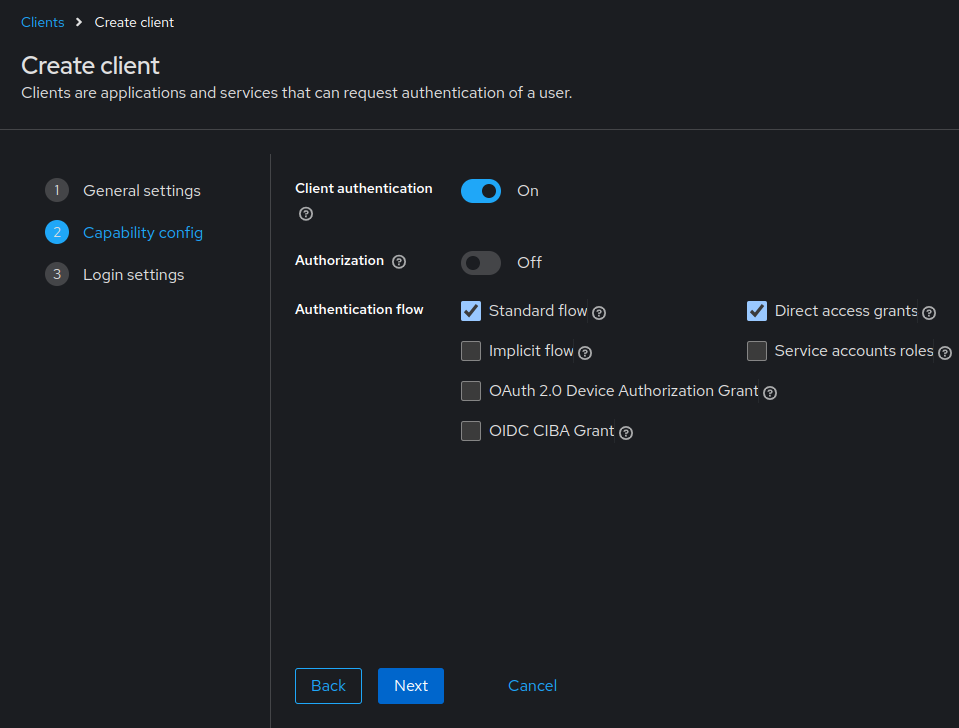
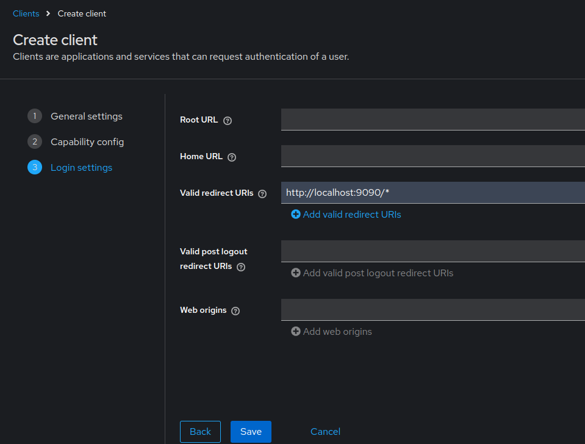
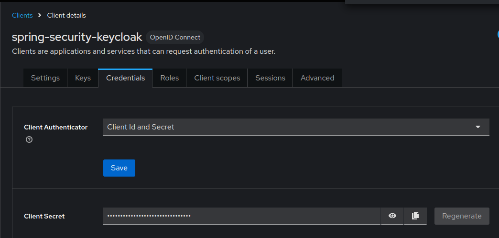

# Projeto Spring Boot com Keycloak e OAuth2 🌱

Este é um projeto de exemplo que utiliza **Spring Boot**, **OAuth2**, e **Keycloak** para implementar autenticação e autorização em uma aplicação web. 

O Keycloak atua como authorization server, ele vai autorizar aplicações parceiras à acessar recursos protegidos da aplicação tuilizando o OAuth2 e o OIDC.

## Tecnologias Utilizadas

- **Spring Boot**
- **Spring Security**
- **OAuth2**
- **Keycloak**   

## Configuração do Keycloak
 
#### 1. **Keycloak** precisa estar em execução:
```bash
docker run -p 8080:8080 -e KC_BOOTSTRAP_ADMIN_USERNAME=admin -e KC_BOOTSTRAP_ADMIN_PASSWORD=admin quay.io/keycloak/keycloak:26.0.5 start-dev
```
#### 2. Configurar um **realm**, nesse caso foi utilizado o nome `ifsc`.

   Essa realm vai atuar como um tenent, um grupo de usuários que compartilham um sistema comum.

   

#### 3. Crie um usuário para logar na aplicação:
   > Note o seguinte: Está sendo utilizado usuário próprio. Também é possível colocar o Google como provedor de identidade

   3.1. Na aba **Users**, preencha com as seguintes informações e depois clique em _Create_.

   

   3.2. Ainda na aba **Users**, clique em **Credentials** e configure uma senha para este usuário. Ao final, clique em _Save_.

   

#### 4. Criar um **cliente OAuth2** no Keycloak:

   A ideia do OAuth é autorizar terceiros à acessar um recurso protegido, então esses terceiros também devem ser conhecidos, são os chamados clientes.

   Não basta autenticar o usuário, a aplicação também deve ser conhecida.
   
   4.1. Clique na aba **Clients** e em seguida no botão **Create client**

   

   4.2. Após pressionar "Create client", vamos ter as seguintes opções a serem preenchidas:
   - `client-id`: `spring-security-keycloak`
   
   
 
   4.3. Pressionar _Next_ e na próxima tela, habilitar a opção **Client Authentication** em que faz ser gerada uma credencial para o client id, o chamado "client secret". Após isso, _Next_.

   

   4.4. Esta é a última aba de configuração do cliente. Aqui, é necessário configurar o URI de redirecionamento da aplicação, garantindo que, durante o fluxo de Authorization Code, o endereço de redirecionamento seja reconhecido como válido para este cliente.
   
   - `Valid redirect URIs`: `http://localhost:9090/*`
   

   Após isso, clicar em _Save_. 

    
#### 5. Configurar as credenciais do cliente e o URI do emissor no aaplication.yml.

Ao acessar a aba **Credentials**, ainda em **Clients**, podemos verificar a _client secret_.



Copiar o conteúdo do campo _client secret_ e adicionar ao `application.yml`.
 
## Como Executar

1. Certifique-se de que o Keycloak está configurado e em execução conforme descrito acima.
2. Execute a aplicação Spring Boot com o comando:

   ```bash
   ./gradlew bootrun
   ```
3. Acesse as rotas para testar:
- `http://localhost:9090/public `
- `http://localhost:9090/private`
- `http://localhost:9090/cookie` 
 