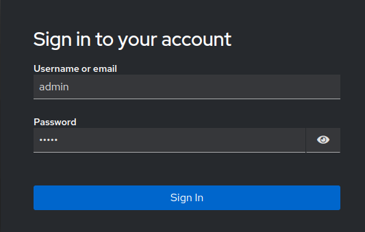
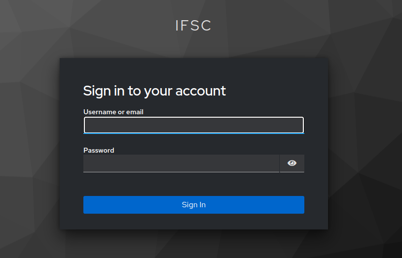
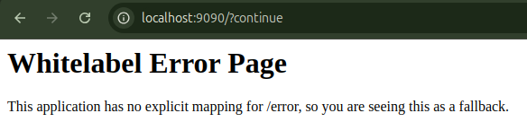
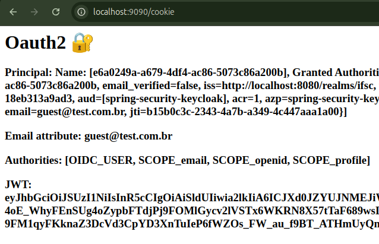

# Projeto Spring Boot com Keycloak e OAuth2 🌿

Este é um projeto de exemplo que utiliza **Spring Boot** e **Keycloak** para implementar autenticação e autorização em uma aplicação web. 

O Keycloak atua como authorization server, ele vai autorizar aplicações parceiras à acessar recursos protegidos da aplicação utilizando o **OAuth2** e o **OIDC**.

## Tecnologias ✨
- **Spring Boot**
- **Spring Security**
- **OAuth2**
- **Keycloak**   

## Manual 📚
###  📕 Parte 1. Configuração do Keycloak 

Antes de executar a aplicação é necessária a configuração do Keycloak 
#### 📌 1. **Keycloak** precisa estar em execução:

   ```bash
   docker run -p 8080:8080 -e KC_BOOTSTRAP_ADMIN_USERNAME=admin -e KC_BOOTSTRAP_ADMIN_PASSWORD=admin quay.io/keycloak/keycloak:26.0.5 start-dev
   ```
   Efetuar login com as credenciais definidas no comando anterior:
   - `Username`: admin
   - `Password`: admin

   

#### 📌 2. Configurar um **realm**, nesse caso foi utilizado o nome `ifsc`.

   Essa realm vai atuar como um tenent, um grupo de usuários que compartilham um sistema comum.

   

#### 📌 3. Crie um usuário para logar na aplicação:
   > Note o seguinte: Está sendo utilizado usuário próprio. Também é possível colocar o Google como provedor de identidade

   3.1. Na aba **Users**, preencha com as seguintes informações e depois clique em _Create_.

   

   3.2. Ainda na aba **Users**, clique em **Credentials** e configure uma senha para este usuário. Ao final, clique em _Save_.

   

#### 📌 4. Criar um **cliente OAuth2** no Keycloak:

   A ideia do OAuth é autorizar terceiros à acessar um recurso protegido, então esses terceiros também devem ser conhecidos, são os chamados clientes.

   Não basta autenticar o usuário, a aplicação também deve ser conhecida.
   
   4.1. Clique na aba **Clients** e em seguida no botão **Create client**

   

   4.2. Após pressionar "Create client", vamos ter as seguintes opções a serem preenchidas:
   - `client-id`: `spring-security-keycloak`
   
   
 
   4.3. Pressionar _Next_ e na próxima tela, habilitar a opção **Client Authentication** em que faz ser gerada uma credencial para o client id, o chamado "client secret". Após isso, _Next_.

   

   4.4. Esta é a última aba de configuração do cliente. Aqui, é necessário configurar o URI de redirecionamento da aplicação, garantindo que, durante o fluxo de Authorization Code, o endereço de redirecionamento seja reconhecido como válido para este cliente.
   
   - `Valid redirect URIs`: `http://localhost:9090/*`

   

   Após isso, clicar em _Save_. 

    
#### 📌 5. Configurar as credenciais do cliente e o URI do emissor no aplication.yml.

Ao acessar a aba **Credentials**, ainda em **Clients**, podemos verificar a _client secret_.


Copiar o conteúdo do campo _client secret_ e adicionar ao `application.yml`.
 
### 📘 Parte 2. Executar a Aplicação 

#### 📌 1. Execute a aplicação Spring Boot com o comando:

   ```bash
   ./gradlew bootrun
   ```

#### 📌 2. Acesse a rota da aplicação: `localhost:9090`
#### 📌 3. Preencha as credenciais do usuário cadastrado durante a configuração do Keycloak:
   - `Username`: "Guest"
   - `Password`: "123"

   

   Note que estamos na realm "IFSC".

   Obtemos "Whitelabel Error Page", pois não há uma implementação na hora do redirecionamento. 
   
   
    
   Porém, o usuário já está autenticado. 

#### 📌 4. Acesse as rotas para testar: 
- `localhost:9090/cookie` 

   
 
- `localhost:9090/private`

   
 
 ## Estudos Futuros 🔎

 - Autenticação com Passkeys: https://www.keycloak.org/2023/11/keycloak-2300-released  
 - user Federation: https://www.keycloak.org/docs/latest/server_admin/#_user-storage-federation (LDPA)